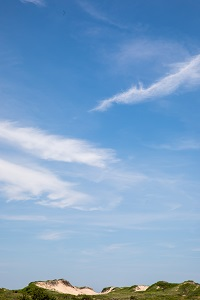
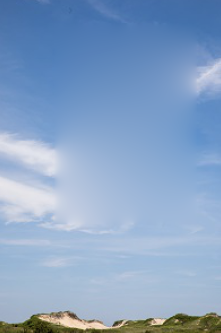
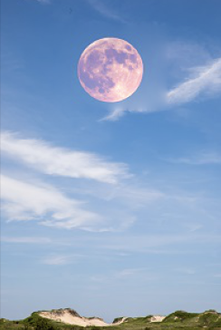
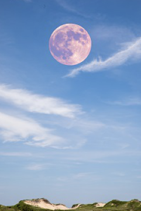
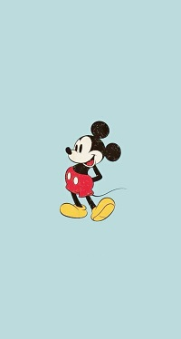
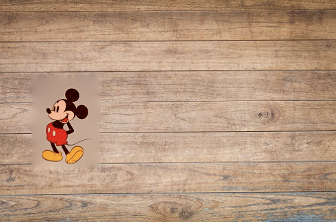
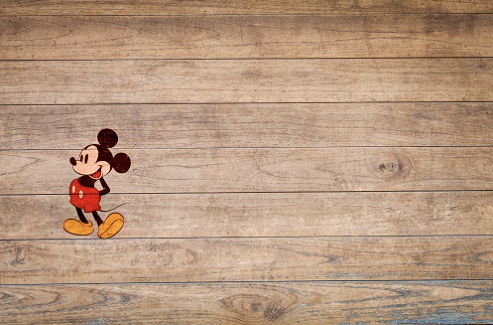

# Poisson Image Editing Project
In this project, I implemented Poisson image editing techniques based on the SIGGRAPH 2003 paper by P. P´erez, M. Gangnet, and A. Blake. The implementation consists of a Python Jupyter notebook that includes four main tasks.

## Task 1: Grayscale Image Editing
In this task, I selected a grayscale image and marked out a region R using a polygon. I then removed the selected region and filled it in using Equation (2) in the paper to solve for unknown intensity values inside the region R. I tested the method in both smooth regions and regions with edges (high-frequency) and reported the behavior as the size of the selected region increased.

  
  

## Task 2: Seamless Cloning for Grayscale Images
In this task, I implemented two versions of seamless cloning for grayscale images: importing gradients and mixing gradients. I selected two images to edit and showed the results for them.

## Task 3: Seamless Cloning for Color Images
I repeated the Seamless Cloning task for color images, processing red, green, and blue components separately.

  
  
  

 

  
  
  

## Task 4: Selection Editing Effects
In this task, I implemented one of the selection editing effects described in Section 4 of the paper, the local color changes, by changing the color gradient for a desired object inside the image.

  
  
  

I hope you find my implementation of Poisson image editing techniques helpful and informative. Thank you for checking out my project!
